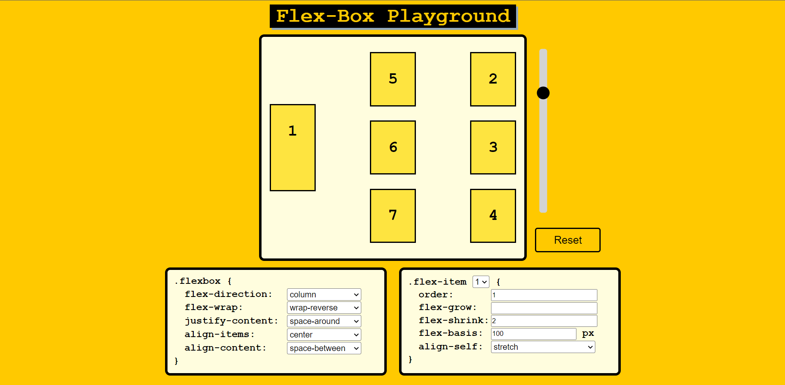

# Flex-Box-Playground

## Overview

### The challenge

Users should be able to:

- View the optimal layout for the component depending on their device's screen size
- See hover states for all interactive elements on the page
- Learn the basics of CSS Flexbox property
- Track the changes on the board by giving different styles to the board
- Give unique style to each of the boxes
- Reset all of the values to their default

### Screenshot

### Links

- Live Site URL: [https://yusuf-demirci.github.io/Flex-Box-Playground/](https://yusuf-demirci.github.io/Flex-Box-Playground/)

### Built with

- Semantic HTML5 markup
- CSS custom properties
- Flexbox
- Mobile-first workflow
- JavaScript & JQuery & JQuery UI
